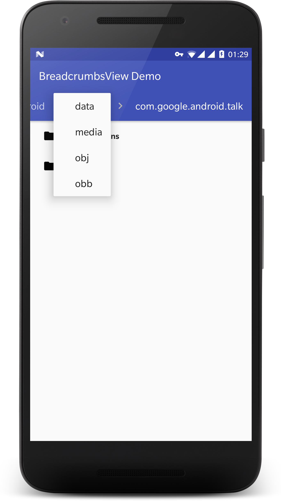

# BreadcrumbsView

[](https://jitpack.io/#moe.feng/BreadcrumbsView)

Material Design Breadcrumbs Navigation Widget on Android (SDK 19+, Maybe can be lower)



## How to use

### Import (Gradle)

First, add it in your root build.gradle at the end of repositories:

```gradle
allprojects {
	repositories {
		...
		maven { url 'https://jitpack.io' }
	}
}
```

Add the dependency to your app modules:

```gradle
dependencies {
    compile 'moe.feng:BreadcrumbsView:latest-version'
}
```

### XML

Place a `BreadcrumbsView` to where you want in your layout xml.

For example:

```xml
<android.support.design.widget.AppBarLayout...>

	<android.support.v7.widget.Toolbar.../>

	<moe.feng.common.view.breadcrumbs.BreadcrumbsView
		android:id="@+id/breadcrumbs_view"
		android:layout_width="match_parent"
		android:layout_height="?attr/actionBarSize"
		app:popupTheme="@style/AppTheme.PopupOverlay"/>

</android.support.design.widget.AppBarLayout>
```

### Add/Remove `BreadcrumbItem`

When your interface navigates to next step, create a new `BreadcrumbItem` and add it to `BreadcrumbsView`.

Use `removeItemAfter(int)` or `removeLastItem` to remove items or last item.

### Listen events

You can set a callback for `BreadcrumbsView` to receive item click/changed events.

To simplify events, I recommend to use `DefaultBreadcrumbsCallback` :

```java
new DefaultBreadcrumbsCallback() {
	@Override
	public void onNavigateBack(BreadcrumbItem item, int position) {
		// ...
	}

	@Override
	public void onNavigateNewLocation(BreadcrumbItem newItem, int changedPosition) {
		// ...
	}
}
```

## License

```
MIT License

Copyright (c) 2017 Fung Go (fython)

Permission is hereby granted, free of charge, to any person obtaining a copy
of this software and associated documentation files (the "Software"), to deal
in the Software without restriction, including without limitation the rights
to use, copy, modify, merge, publish, distribute, sublicense, and/or sell
copies of the Software, and to permit persons to whom the Software is
furnished to do so, subject to the following conditions:

The above copyright notice and this permission notice shall be included in all
copies or substantial portions of the Software.

THE SOFTWARE IS PROVIDED "AS IS", WITHOUT WARRANTY OF ANY KIND, EXPRESS OR
IMPLIED, INCLUDING BUT NOT LIMITED TO THE WARRANTIES OF MERCHANTABILITY,
FITNESS FOR A PARTICULAR PURPOSE AND NONINFRINGEMENT. IN NO EVENT SHALL THE
AUTHORS OR COPYRIGHT HOLDERS BE LIABLE FOR ANY CLAIM, DAMAGES OR OTHER
LIABILITY, WHETHER IN AN ACTION OF CONTRACT, TORT OR OTHERWISE, ARISING FROM,
OUT OF OR IN CONNECTION WITH THE SOFTWARE OR THE USE OR OTHER DEALINGS IN THE
SOFTWARE.
```